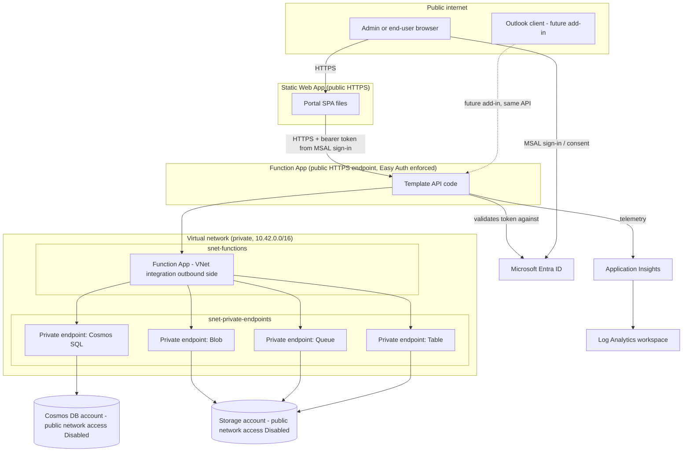
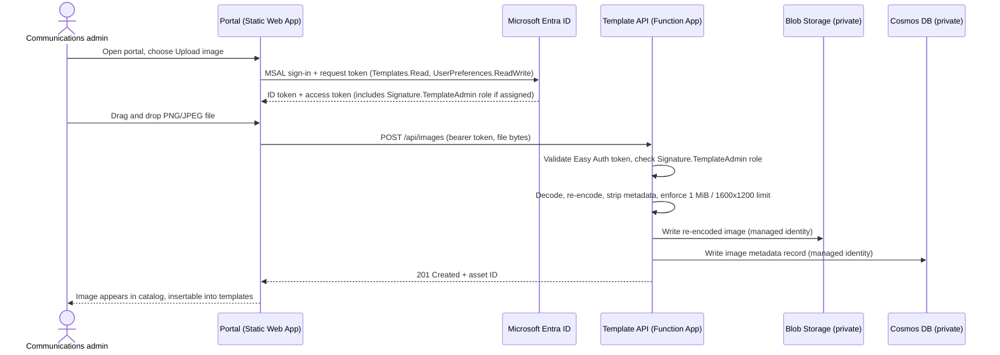
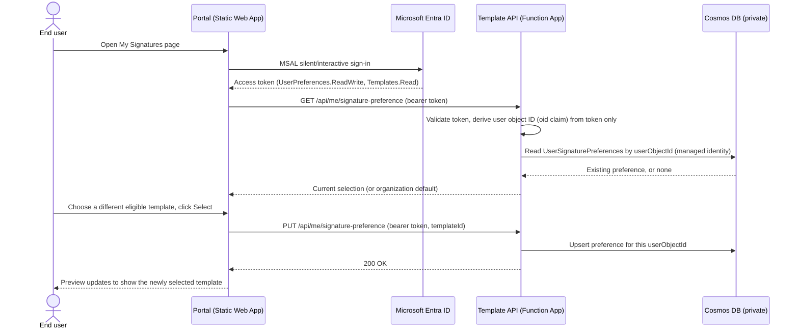
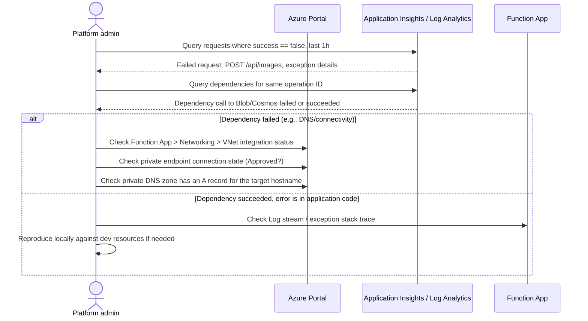

# Infrastructure Design and Troubleshooting Guide

This document is for **Platform Administrators**: the people who deploy, monitor, troubleshoot, and eventually tear down the Azure resources behind Signature Studio. It explains, in plain language, what each Azure resource is for, how the resources depend on each other, how to safely look at (and never bypass) the persisted data when troubleshooting, and the exact steps to deploy, roll back, and clean up the environment.

This document does not repeat the Entra ID app registration walkthrough (SPA/API scopes, app roles). See [README.md](README.md#prerequisites) and [apps/portal/README.md](apps/portal/README.md#register-the-portal-spa-app-registration) for that. This document assumes those app registrations already exist and focuses purely on the Azure infrastructure and application hosting.

For application component responsibilities and current-versus-planned data flows, see [SolutionDesign.md](SolutionDesign.md).

## 1. Plain-language solution summary

- Communications administrators use a web app prototype (the **Portal**) to edit sample templates, upload corporate images, and manage per-user signature preferences. Template edits are not yet published or persisted.
- The Portal talks to a small backend (the **Template API**) running on Azure Functions. The API is the only thing allowed to read or write the database and file storage.
- Image metadata, selected-template preferences, and application-audit records are stored in **Cosmos DB**. Image bytes are stored in **Blob Storage**. A Cosmos `Templates` container is provisioned, but the API does not yet persist/publish template documents.
- The database and file storage have **no public internet access at all** — only the API, running inside a private network (VNet), can reach them. This is a deliberate security control, not a misconfiguration: if you can't `curl` Cosmos or Blob Storage from your laptop, that is correct.
- The API authenticates every request using Microsoft Entra ID (the organization's identity provider) — it does not have its own username/password system.
- An Outlook event-based add-in proof of concept exists, but it inserts test-only content and is not connected to templates, Graph profile data, images, preferences, or audit delivery.
- Everything is deployed with one Bicep template ([infra/main.bicep](infra/main.bicep)) so the whole environment can be recreated, audited, or rolled back consistently.

## 2. Resource inventory

Every resource below is created by [infra/main.bicep](infra/main.bicep) into a single dedicated resource group. Names are generated as `<namingPrefix>-<uniqueSuffix>-<role>` (for example `sigd-ab12cd34efgh-api`), except the Storage account, which strips dashes because storage account names cannot contain them.

| # | Resource | Azure type | Plain-language purpose |
|---|---|---|---|
| 1 | Static Web App | `Microsoft.Web/staticSites` | Hosts the built Portal (React SPA) files and serves them over HTTPS to browsers. This is the thing Communications admins and end users open in their browser. |
| 2 | Function App | `Microsoft.Web/sites` (kind `functionapp,linux`) | Runs the Template API code (Node.js 22, Linux). Every read/write of templates, images, and preferences goes through this. |
| 3 | Function App's App Service Plan | `Microsoft.Web/serverfarms` (SKU `EP1`, Elastic Premium) | The compute capacity the Function App runs on. Premium plan is required because VNet integration (private networking) needs it — the free/Consumption plan can't do this. |
| 4 | Cosmos DB account | `Microsoft.DocumentDB/databaseAccounts` | The serverless database (billed per request, not per hour). It provisions containers for future templates, image metadata, per-user preferences, and audit records. Template document persistence/publication is not implemented yet. |
| 5 | Storage account | `Microsoft.Storage/storageAccounts` (SKU `Standard_ZRS`) | Blob storage that holds the actual uploaded image bytes (PNG/JPEG), plus the Function App's own internal "AzureWebJobsStorage" housekeeping data (queues/tables). |
| 6 | Virtual Network (VNet) | `Microsoft.Network/virtualNetworks` | A private network inside Azure. The Function App and the private endpoints (see below) all live inside this network so traffic to the database and storage never crosses the public internet. |
| 7 | Two subnets | `Microsoft.Network/virtualNetworks/subnets` | `snet-functions` — delegated to the Function App so it can join the VNet. `snet-private-endpoints` — where the private endpoints (item 8) get their private IP addresses. |
| 8 | Four private endpoints | `Microsoft.Network/privateEndpoints` | Give Cosmos DB (SQL), Blob, Queue, and Table services a private IP address inside the VNet, so the Function App can reach them without going over the internet. One endpoint per service surface. |
| 9 | Four private DNS zones + VNet links | `Microsoft.Network/privateDnsZones` | Make `<account>.documents.azure.com`, `<account>.blob.core.windows.net`, etc. resolve to the private IP addresses from item 8 instead of a public IP, but only for resources inside this VNet. |
| 10 | Log Analytics workspace | `Microsoft.OperationalInsights/workspaces` | Central place where Application Insights telemetry (below) and platform diagnostic logs are stored and queried. 30-day retention. |
| 11 | Application Insights | `Microsoft.Insights/components` | Collects Function App requests, exceptions, and dependency calls (to Cosmos/Blob) for troubleshooting and performance monitoring. |
| 12 | RBAC role assignments (5 total) | `Microsoft.Authorization/roleAssignments` and Cosmos SQL role assignment | Grants the Function App's managed identity permission to read/write Cosmos data and Blob/Queue/Table data. See section 4. |

### What is deliberately *not* there

- No VPN gateway or ExpressRoute — this design assumes the Function App is the only thing that needs private access to data services; it is not meant to let your laptop join the VNet.
- No Key Vault — there are no secrets to store. Authentication to Cosmos/Blob is by managed identity (no connection strings/keys); authentication of users is by Entra ID tokens validated by the Function App's built-in Easy Auth. If you later add a secret (e.g., a third-party API key), add Key Vault at that point rather than putting it in application settings.
- No custom domain / Front Door / WAF — the Static Web App's default `*.azurestaticapps.net` hostname is used. Add a custom domain and/or Front Door later if the organization requires it; this is out of scope for the current template.

## 3. How the pieces depend on each other



**Read this diagram as:** nothing outside the VNet — not your laptop, not a hacked script, not even an Azure Portal "browse data" attempt from the public internet — can reach Cosmos or Blob Storage directly, because `publicNetworkAccess` is `Disabled` on both. The only path in is through the Function App, which is inside the VNet and holds the only granted identity (see section 4).

### Deployment-time dependency order

Bicep resolves this automatically (you do not need to sequence it yourself), but understanding the order helps when reading `what-if` output or diagnosing a partial failure:

1. VNet and its two subnets.
2. Private DNS zones and their VNet links (independent of the VNet's subnets, only needs the VNet itself).
3. Log Analytics workspace, then Application Insights (needs the workspace ID).
4. Static Web App (independent — no dependency on the VNet).
5. Storage account, then its blob service settings, then the `signature-assets` container.
6. Function App's server farm (App Service Plan), then the Function App itself (needs the plan, the subnet, and the Storage account name for its own housekeeping storage), then its Easy Auth settings.
7. Cosmos account, then its database, then its four containers.
8. RBAC role assignments (need the Function App's managed identity principal ID, which only exists once the Function App resource above is created).
9. Private endpoints (need the Cosmos/Storage resource IDs and the private-endpoint subnet), then their DNS zone group bindings (need the endpoints and the DNS zones from step 2).

## 4. Identity and access — how the API is allowed to touch data

There are two entirely separate authentication/authorization layers. Do not confuse them when troubleshooting a "permission denied" symptom.

### 4a. Who is allowed to call the API (human/browser identity)

- The Function App has **Easy Auth** (`Microsoft.Web/sites/config/authsettingsV2`) turned on, requiring every request to present a valid Entra ID token for the API's own app registration. Unauthenticated requests get an automatic `401` before your function code even runs.
- The Portal signs the user in with MSAL against the **SPA** app registration, then requests a token for the **Template API** app registration's delegated scopes (`Templates.Read`, `UserPreferences.ReadWrite`), and sends that token as a bearer token to the Function App.
- Inside the function code, fine-grained authorization is enforced per-route:
  - `GET /api/images`, `GET /api/images/{assetId}` — require the `Templates.Read` scope/role in the token.
  - `POST /api/images` (upload) — additionally requires the `Signature.TemplateAdmin` app role.
  - `GET|PUT /api/me/signature-preference` — require `UserPreferences.ReadWrite`; the API always uses the calling user's own object ID (`oid` claim) from the token, so a user can never read or write another user's preference.
  - `POST /api/audit/signature-applications` — the future Outlook add-in's audit call; the API derives the actor from the token, ignoring any client-supplied user ID.
- This layer is entirely about **who is allowed to ask the API to do something**. See [README.md](README.md#prerequisites) for how these app registrations, scopes, and roles are configured.

### 4b. Who is allowed to touch the database and storage (service identity)

- The Function App has a **System-assigned managed identity** — effectively an auto-generated, credential-free service account tied to that one Function App resource.
- Bicep grants that identity exactly four data-plane roles, and nothing else:

  | Role assignment | Scope | Role | What it allows |
  |---|---|---|---|
  | Cosmos SQL role assignment | Cosmos account | Cosmos DB Built-in Data Contributor (`00000000-0000-0000-0000-000000000002`) | Read/write items in any container in the Cosmos account |
  | Azure RBAC role assignment | Storage account | Storage Blob Data Contributor (`ba92f5b4-2d11-453d-a403-e96b0029c9fe`) | Read/write blobs (the uploaded images) |
  | Azure RBAC role assignment | Storage account | Storage Queue Data Contributor (`974c5e8b-45b9-4653-ba55-5f855dd0fb88`) | Used by the Azure Functions runtime's own internal queuing, not application code |
  | Azure RBAC role assignment | Storage account | Storage Table Data Contributor (`0a9a7e1f-b9d0-4cc4-a60d-0319b160aaa3`) | Used by the Azure Functions runtime's own internal bookkeeping, not application code |

- There are **no connection strings, account keys, or shared-key secrets anywhere** in this solution. `allowSharedKeyAccess: false` and `disableLocalAuth: true` are set on the Storage account and Cosmos account respectively — this is enforced by Azure, not just by convention. If you ever see a connection string with `AccountKey=` for this solution, that is a sign someone bypassed the intended design.
- The Function App's own application settings (`COSMOS_ENDPOINT`, `ASSETS_BLOB_ENDPOINT`, `AzureWebJobsStorage__accountName` + `AzureWebJobsStorage__credential=managedidentity`) only contain **URLs and account names** — never secrets — because the SDKs use the managed identity to authenticate.

## 5. How Platform Admins can safely view persisted data for troubleshooting

Cosmos DB and Blob Storage have public network access disabled and are reachable by the API through private endpoints inside the VNet. Azure Portal Data Explorer and Storage Browser are browser-based tools: a request can come from your workstation's public IP, not from an Azure control-plane proxy. The Cosmos error `Request originated from IP ... through public internet. This is blocked by your Cosmos DB account firewall settings` means the network firewall rejected the request before checking your Cosmos data-plane role. Both the network path and the data permission must be allowed.

Use one of the following approved access paths:

### Option A — Private network access (recommended)

Use a managed workstation connected to the solution VNet (for example, through an approved VPN or a jump host/VM in that VNet). The private DNS zones must resolve the Cosmos and Blob service hostnames to their private endpoint IPs. This keeps public network access disabled and is the preferred option for routine or sensitive troubleshooting. The current deployment does not create a VPN or jump host automatically; these must be provided and secured by the platform team.

#### 5a. Cosmos DB Data Explorer access

The Function App's **managed identity** role assignment (section 4b) only grants the running API access to data — it does **not** give any human, including the resource group's Owner/Contributor, access to browse data in Data Explorer. Azure Cosmos DB has **two independent RBAC systems**, and this is the single most common Cosmos access mistake:

- **Azure RBAC (Access control (IAM) blade)** — controls who can manage the Cosmos *account itself* (change settings, view keys, delete the resource). Being an Owner/Contributor here does **not** grant data access.
- **Cosmos SQL data-plane RBAC** — a separate, Cosmos-specific role assignment system that controls who can read/write the actual items in containers, including through Data Explorer. This is what you're missing if you see the error below.

**Permission error:** opening **Data Explorer** shows a red notification banner: `Request blocked by Auth <cosmos-account-name>: Request is blocked because principal [<your-object-id>] does not have required RBAC permissions to perform action [Microsoft.DocumentDB/databaseAccounts/readMetadata] on resource [/]`. This means the SQL data-plane role assignment is missing; grant Data Reader as described below.

**Network/firewall error:** a message such as `Request originated from IP <address> through public internet. This is blocked by your Cosmos DB account firewall settings` means the request reached the public Cosmos endpoint from outside the allowed network. A Cosmos SQL role assignment does not bypass this firewall. Stay on a private network connected to the VNet, or use the temporary public-IP procedure in Option B below if approved.

**Steps to grant yourself (or another Platform Admin) read access:**

1. Find your own Entra object ID: `az ad signed-in-user show --query id -o tsv`, or copy it directly from the object ID shown in the Data Explorer error notification.
2. List the two built-in Cosmos SQL role definitions available on this account (IDs are fixed/well-known, but confirm they exist on your account):
   ```sh
   az cosmosdb sql role definition list \
     --account-name <cosmos-account-name> \
     --resource-group <resource-group> \
     --query "[].{name:roleName, id:name}" -o table
   ```
3. Assign yourself the **Cosmos DB Built-in Data Reader** role (role definition ID `00000000-0000-0000-0000-000000000001`) at the account scope:
   ```sh
   az cosmosdb sql role assignment create \
     --account-name <cosmos-account-name> \
     --resource-group <resource-group> \
     --scope "/" \
     --principal-id <your-entra-object-id> \
     --role-definition-id 00000000-0000-0000-0000-000000000001
   ```
   Only use `00000000-0000-0000-0000-000000000002` (**Data Contributor**) if you genuinely need to edit or delete records from the Portal — prefer Data Reader for routine troubleshooting.
4. Reload the Data Explorer tab in the Azure Portal (no sign-out/sign-in required; the new role takes effect within a minute or two). The permission error should be gone. If the firewall error remains, your current network path is still outside the VNet; use Option A or Option B.
5. **When you're done troubleshooting**, decide whether to keep or remove the assignment: for a Platform Admin who will regularly need this access, it's reasonable to leave it in place long-term (it only grants data-plane read, not account management). For a one-off investigation by someone who shouldn't have standing access, remove it afterwards:
   ```sh
   az cosmosdb sql role assignment list \
     --account-name <cosmos-account-name> \
     --resource-group <resource-group> \
     --query "[?principalId=='<your-entra-object-id>'].id" -o tsv
   az cosmosdb sql role assignment delete \
     --account-name <cosmos-account-name> \
     --resource-group <resource-group> \
     --role-assignment-id <id-from-previous-command> --yes
   ```

#### 5b. Blob Storage browser access

- Azure Portal → the storage account → **Storage browser** → **Blob containers** → `signature-assets`. Because `allowSharedKeyAccess` is disabled, authenticate with **Microsoft Entra User Account** (OAuth), not an access key. The browser still needs a permitted network route to the storage endpoint; a data role does not bypass the storage firewall.
- This uses ordinary Azure RBAC (not a separate data-plane system like Cosmos), so you need the **Storage Blob Data Reader** (or **Storage Blob Data Contributor** to also upload/delete) role on the storage account, assigned to your own account:
  ```sh
  az role assignment create \
    --assignee <your-entra-object-id-or-upn> \
    --role "Storage Blob Data Reader" \
    --scope <storage-account-resource-id>
  ```
- If Storage Browser reports an authorization failure, first distinguish a data-role error from a network/firewall error. Get the storage account's resource ID with `az storage account show --name <storage-account-name> --resource-group <resource-group> --query id -o tsv` for the `--scope` value above. If the message identifies a blocked public IP/network, use Option A or the temporary public-IP procedure in Option B.
- For one-time troubleshooting, make the Reader assignment temporary too. Save the `id` returned by `az role assignment create`; use that exact assignment ID to remove it after the session or in the scheduled revocation described below. Do not remove a role assignment by role name/scope if other admins may have their own assignments.

### Option B — Temporary public-IP allowlist (only if private access is unavailable and approved)

For a short, supervised troubleshooting session from a workstation outside the VNet, a Platform Admin with permission to change networking can temporarily enable public network access while allowing only the workstation's current public IPv4 address. This is less secure than Option A; prefer the private path. Do not use `0.0.0.0/0`, broad ranges, or the "allow all networks" setting.

**Important: Cosmos DB does not automatically expire IP firewall rules.** Before enabling the exception, arrange a one-hour restore timer (or another explicitly approved duration) that sets `publicNetworkAccess` back to `Disabled` and clears the temporary IP rule. Do not rely on remembering to remove it later. For a production/recurring workflow, use a cloud-hosted scheduler such as an Azure Automation runbook with a managed identity scoped to this Cosmos account; the current deployment does not provision such a scheduler. For a one-off session, the following detached local timer works while the admin machine remains available and its Azure CLI session can authenticate:

```sh
nohup sh -c 'sleep 3600; az cosmosdb update --name <cosmos-account-name> --resource-group <resource-group> --public-network-access Disabled --ip-range-filter ""; az cosmosdb show --name <cosmos-account-name> --resource-group <resource-group> --query "{publicNetworkAccess:publicNetworkAccess, ipRules:ipRules}" -o json' \
  > "$HOME/cosmos-firewall-revoke.log" 2>&1 < /dev/null &
echo "Revoke timer PID: $!"
```

Run that command **before** enabling the firewall exception, record the PID, and verify the process is running (`ps -p <pid> -o pid=,stat=,cmd=`). The timer waits 3600 seconds (one hour), disables public access, clears the IP rule, and writes the result to `~/cosmos-firewall-revoke.log`. Keep the admin machine on and ensure `az login` remains usable. If the timer process is stopped, the machine shuts down, or Azure CLI cannot authenticate at expiry, immediately restore the settings manually; the access exception is not self-expiring at the Cosmos service.

**Cosmos DB:** the deployed account currently has `publicNetworkAccess: Disabled`, `ipRules: []`, and `networkAclBypass: None`. The following is an exception for the current reported client IP only; use your current public IP instead if it changes. First record the current network settings and confirm no existing IP allowlist will be overwritten:

```sh
az cosmosdb show \
  --name <cosmos-account-name> \
  --resource-group <resource-group> \
  --query "{publicNetworkAccess:publicNetworkAccess, ipRules:ipRules, networkAclBypass:networkAclBypass}" -o json
```

If the existing state matches the deployment (`Disabled` and no IP rules), and after confirming the timer is running, temporarily allow only the workstation's current public IPv4 address:

```sh
az cosmosdb update \
  --name <cosmos-account-name> \
  --resource-group <resource-group> \
  --public-network-access Enabled \
  --ip-range-filter <workstation-public-ipv4>
```

Keep the Cosmos **Data Reader** role assigned as described in section 5a; network access alone does not grant data access. Test Data Explorer, then immediately restore the deployed private-only posture:

```sh
az cosmosdb update \
  --name <cosmos-account-name> \
  --resource-group <resource-group> \
  --public-network-access Disabled \
  --ip-range-filter ""
```

Verify restoration:

```sh
az cosmosdb show \
  --name <cosmos-account-name> \
  --resource-group <resource-group> \
  --query "{publicNetworkAccess:publicNetworkAccess, ipRules:ipRules}" -o json
```

It should show `publicNetworkAccess` as `Disabled` and no IP rules. Do not run the example unchanged if the pre-check shows existing rules or a different access mode; preserve and restore the original settings. Apply changes through a reviewed change window, because any period with public access enabled—even with one IP allowed—temporarily changes the private-only design. After the timer fires, inspect `~/cosmos-firewall-revoke.log` and verify the account state using the `az cosmosdb show` command above.

**Blob Storage:** the deployed account's baseline is `publicNetworkAccess: Disabled`, network rule `defaultAction: Deny`, and no IP rules. A temporary browser inspection requires both a narrow network exception and a data role. Capture the current state first, and proceed with the following only if it matches that baseline:

```sh
az storage account show \
  --name <storage-account-name> \
  --resource-group <resource-group> \
  --query "{publicNetworkAccess:publicNetworkAccess,defaultAction:networkRuleSet.defaultAction,ipRules:networkRuleSet.ipRules}" -o json
```

1. Schedule the one-hour revocation **before** granting access. Use the command below, replacing the account/resource-group/IP and assignment ID with the values for the change. For a permanent operational process, use an Azure-hosted scheduler with a managed identity; a local timer is only a one-off fallback and depends on the host remaining on and Azure CLI authentication working.
2. Enable only the selected-network mode, keep the default action `Deny`, and add only the workstation's current public IPv4 address:
   ```sh
   az storage account update \
     --name <storage-account-name> --resource-group <resource-group> \
     --public-network-access Enabled --default-action Deny
   az storage account network-rule add \
     --account-name <storage-account-name> --resource-group <resource-group> \
     --ip-address <workstation-public-ipv4>
   ```
3. Assign **Storage Blob Data Reader** at this storage account's scope. Save the assignment ID from the result for scheduled removal:
   ```sh
   az role assignment create \
     --assignee-object-id <your-entra-object-id> \
     --assignee-principal-type User \
     --role "Storage Blob Data Reader" \
     --scope <storage-account-resource-id> \
     --query "{id:id,role:roleDefinitionName,scope:scope}" -o json
   ```
4. Reload Storage Browser, inspect only what is needed, and avoid uploading, deleting, or changing blobs.
5. Verify revocation either when the timer fires or immediately after ending the session:
   ```sh
   az storage account show --name <storage-account-name> --resource-group <resource-group> \
     --query "{publicNetworkAccess:publicNetworkAccess,defaultAction:networkRuleSet.defaultAction,ipRules:networkRuleSet.ipRules}" -o json
   az role assignment list --assignee-object-id <your-entra-object-id> --scope <storage-account-resource-id> \
     --query "[?roleDefinitionName=='Storage Blob Data Reader'].{id:id,role:roleDefinitionName}" -o table
   ```
   Expected after revocation: `publicNetworkAccess` is `Disabled`, `ipRules` is empty, and the temporary Reader assignment is absent.

**One-hour detached local revocation timer:** obtain the exact role assignment resource ID from the role assignment creation output. Start this timer before enabling access; replace all placeholders. It removes only the specified IP rule and the exact temporary RBAC assignment, disables public access, then logs the resulting state:

```sh
nohup sh -c 'sleep 3600
az storage account network-rule remove --account-name <storage-account-name> --resource-group <resource-group> --ip-address <workstation-public-ipv4>
az storage account update --name <storage-account-name> --resource-group <resource-group> --public-network-access Disabled --default-action Deny
az role assignment delete --ids <exact-role-assignment-resource-id> --yes
az storage account show --name <storage-account-name> --resource-group <resource-group> --query "{publicNetworkAccess:publicNetworkAccess,defaultAction:networkRuleSet.defaultAction,ipRules:networkRuleSet.ipRules}" -o json' \
  > "$HOME/storage-firewall-revoke.log" 2>&1 < /dev/null &
echo "Revoke timer PID: $!"
```

Check that the PID remains running (`ps -p <pid> -o pid=,stat=,cmd=`). Do not shut down the host or let its Azure CLI credentials expire before the hour is up. If the timer fails, restore access manually at once and inspect `~/storage-firewall-revoke.log`. The timer is a fallback, not a Cosmos/Storage native expiry feature. Preserve any pre-existing firewall rules or role assignments; do not use this baseline-specific procedure if the pre-check finds any.

### Option C — Application Insights (best first step for most troubleshooting)

For almost all troubleshooting, you do not need to browse raw data at all — check Application Insights first:

- Azure Portal → the Application Insights resource (or the Log Analytics workspace) → **Logs**, and query, for example:
  ```kusto
  requests
  | where timestamp > ago(1h)
  | where success == false
  | order by timestamp desc
  ```
  ```kusto
  dependencies
  | where timestamp > ago(1h)
  | where target contains "documents.azure.com" or target contains "blob.core.windows.net"
  | where success == false
  | order by timestamp desc
  ```
- Function App → **Monitor** → **Log stream** shows near-real-time console output from the running functions — useful for catching an exception as it happens during a manual test.

### What never to do

- Never leave Cosmos DB or the Storage account's public network access enabled after a temporary inspection. The account's normal posture is private endpoints with public access disabled. If a narrowly scoped temporary IP exception is approved, time-box it, allow only the single workstation IP, and verify the public access setting is back to **Disabled** immediately afterwards.
- Never re-enable `allowSharedKeyAccess` on the storage account or `disableLocalAuth: false` on Cosmos to "make troubleshooting easier." Both remove the requirement to authenticate as a specific, auditable Entra identity.

## 6. Sequence diagrams

### 6a. Communications admin uploads an image



### 6b. End user selects a signature template ("My Signatures")



### 6c. Platform admin troubleshooting a "500 error on upload" report



## 7. Common troubleshooting scenarios

| Symptom | Likely cause | Where to check | Fix |
|---|---|---|---|
| Every API call returns `401` | No token sent, expired token, or token for the wrong audience | Browser dev tools → Network tab → check `Authorization: Bearer ...` header is present; decode the token at [jwt.ms](https://jwt.ms) and confirm `aud` matches the API's client ID | Sign out and back in; confirm `VITE_TEMPLATE_API_SCOPE`/`VITE_TEMPLATE_READ_SCOPE` in `.env.local` use the correct API client ID |
| Upload works for one admin but returns `403` for another | The second user has the delegated scopes consented but was never assigned the `Signature.TemplateAdmin` app role | Entra admin center → Enterprise applications → the Template API app → **Users and groups** | Assign the role to that user or their group, then have them sign out/in |
| Function App logs show `ENOTFOUND` or timeout connecting to Cosmos/Blob | VNet integration broken, private DNS zone missing a record, or a private endpoint connection isn't Approved | Function App → **Networking** → **VNet integration**; Private endpoint resource → **DNS configuration** tab; Private DNS zone → check it has an A record for the resource's hostname | Re-run the Bicep deployment (it's idempotent); if a private endpoint shows **Pending**, approve it under the target resource's **Networking > Private endpoint connections** |
| Deployment fails with `LocationNotAvailableForResourceType` for `Microsoft.Web/staticSites` | `location`/`staticWebAppLocation` parameter set to a region that doesn't support Static Web Apps Standard | Deployment error message lists the supported regions | Set `staticWebAppLocation` to one of `centralus`, `eastus2`, `westus2`, `westeurope`, `eastasia` (or whatever the current error message lists) in your parameters file; the rest of the resources can stay in your preferred region via the separate `location` parameter |
| First `swa deploy` fails with `Cannot update staticwebapp.config.json while the config file is locked` | `allowConfigFileUpdates` was `false` on the Static Web App resource | N/A — this is a resource property, not a deploy-time error you can work around | Set `allowConfigFileUpdates: true` in [infra/main.bicep](infra/main.bicep) (already the default in this repo) and redeploy the Bicep template before retrying `swa deploy` |
| Browser console shows `Content-Security-Policy: ... blocked ... (connect-src)` when the Portal calls the API, and every API call silently fails | `VITE_TEMPLATE_API_URL` was not exported into the shell's `process.env` (only Vite's `import.meta.env` for client code) when `apps/portal/scripts/configure-staticwebapp.mjs` ran, so it did not add the API's origin to `connect-src` in the deployed `staticwebapp.config.json` | Browser DevTools Console (the CSP violation names the blocked directive); confirm with `curl -sI <static-web-app-url>/ \| grep -i content-security-policy` and check whether your API's `https://` origin appears after `connect-src` | Rebuild the Portal (`npm run build --workspace=@signature/portal`) after confirming `apps/portal/.env.local` sets `VITE_TEMPLATE_API_URL`; the build script now also loads `.env`/`.env.local` itself and prints a console warning if the API origin is still missing, so a silent CSP gap should no longer go unnoticed. Redeploy with `swa deploy`. |
| `sharp` (image library) throws a native-binding error when the Function App runs | The deployment package was built/zipped on the wrong OS/architecture (for example macOS or Windows), producing the wrong native binary for the Linux Function App | Function App → Log stream, at cold start or on first image upload | Rebuild and zip the deployment package on a Linux x64 host (or CI runner), so `npm install` resolves the Linux x64 `sharp` binary; see [README.md](README.md#deploy-the-application-code) |
| Portal loads but "Sign in" never completes / redirects to an error page | The Static Web App's or localhost's exact URL (with `/auth-redirect.html`) isn't registered as a redirect URI on the SPA app registration | Entra admin center → the SPA app registration → **Authentication** → **Single-page application** redirect URIs | Add the missing URL (protocol, host, port, and path must match exactly) |
| Cosmos/Blob data looks empty even though uploads "succeeded" | You're looking at the wrong resource group/subscription, or a stale browser cache in the Portal blade | Confirm the resource group name and subscription in the Azure Portal breadcrumb match your deployment's `AZURE_RESOURCE_GROUP`/`AZURE_SUBSCRIPTION_ID` | Re-check with the deployment outputs (`cosmosAccountName`, `imageStorageAccountName`) from `az deployment group show` |
| Image upload returns `201` (succeeds) but the preview immediately fails with `Unable to load corporate image (503)` for every image | The API's `getSignatureImage` function always requested a fixed 1 MiB read from Blob Storage (`downloadToBuffer(0, maxImageBytes)`) regardless of the image's real size. The Storage SDK treats that `count` as a strict requirement, not a cap, and throws `Stream drains before getting enough data needed` for any image smaller than 1 MiB — which is nearly all of them | Application Insights → **Transaction search**/Logs → run `traces \| where message has "Corporate image read failed"` (or use `az monitor app-insights query --analytics-query "traces \| where message has 'read failed'"`); the exception message names the exact SDK error | Already fixed in this repo: the function now calls `downloadToBuffer(0, record.byteLength)` using the exact size recorded in Cosmos at upload time. If you see this on a fork/older deployment, apply the same fix in [services/api/signatureImages.ts](services/api/signatureImages.ts) and redeploy the API |
| Opening Cosmos DB **Data Explorer** in the Azure Portal shows a red banner `Request blocked by Auth ...: Request is blocked because principal [...] does not have required RBAC permissions to perform action [Microsoft.DocumentDB/databaseAccounts/readMetadata]` | Your Entra account has Azure RBAC access to the Cosmos *account* (e.g. Owner/Contributor on the resource group) but not the separate **Cosmos SQL data-plane RBAC** role that Data Explorer needs; these are two independent permission systems | The error banner itself names your object ID; also `az cosmosdb sql role assignment list --account-name <cosmos-account-name> --resource-group <resource-group> --query "[?principalId=='<your-object-id>']"` returns empty | Assign yourself the built-in **Cosmos DB Built-in Data Reader** role — see section 5a for the exact `az cosmosdb sql role assignment create` command and follow-up steps |
| Cosmos DB Data Explorer reports `Request originated from IP <address> through public internet. This is blocked by your Cosmos DB account firewall settings` | The request is coming from the administrator's workstation over the public endpoint, while the account's `publicNetworkAccess` is `Disabled`. Cosmos SQL Data Reader permission does not bypass the network firewall | Cosmos account → **Networking**; or `az cosmosdb show --name <cosmos-account-name> --resource-group <resource-group> --query "{publicNetworkAccess:publicNetworkAccess, ipRules:ipRules}" -o json` | Preferred: connect from a managed workstation on the solution VNet and use private DNS. If that is unavailable and a temporary exception is approved, enable public access with only the workstation's current IP allowlisted, then restore `publicNetworkAccess: Disabled` immediately; see section 5 Option B. Do not allow all networks |
| Storage Browser returns `403` and says the account firewall may block the client IP | The request is coming from the administrator's workstation while Storage public access is disabled or the IP is not allowlisted; the user may also lack the separate **Storage Blob Data Reader** data role | Storage account → **Networking** and **Access control (IAM)**; inspect `publicNetworkAccess`, `networkRuleSet.ipRules`, and scoped role assignments | Keep the default action `Deny`, allow only the workstation IP temporarily, grant only **Storage Blob Data Reader**, and schedule both to be revoked after one hour; see section 5b and Option B. Do not enable all networks or shared-key access |

## 8. Deployment steps

These mirror [README.md](README.md#configure-and-deploy) but are repeated here with Platform Admin framing and the application-code step included, so this document is a complete standalone runbook.

1. **Prerequisites** (see [README.md](README.md#prerequisites) for full detail): Azure CLI + Bicep, `az login`, a dedicated resource group, the two Entra app registrations already configured, and a chosen `staticWebAppLocation` if it differs from your main `location`.
2. **Sign in and select the subscription:**
   ```sh
   az login
   az account set --subscription "<subscription-id>"
   az bicep install
   ```
3. **Prepare parameters** (never commit this file — it's gitignored):
   ```sh
   cp infra/parameters/dev.parameters.example.json infra/parameters/dev.parameters.local.json
   ```
   Edit it: set `location`, `staticWebAppLocation`, a 3–5 character lowercase `namingPrefix`, `entraTenantId`, `apiApplicationClientId`, and VNet/subnet ranges that don't overlap any connected network.
4. **Deploy infrastructure:**
   ```sh
   export AZURE_SUBSCRIPTION_ID="<subscription-id>"
   export AZURE_RESOURCE_GROUP="rg-outlook-signature-dev"
   export AZURE_LOCATION="<region matching the location parameter>"
   bash scripts/deploy-azure.sh infra/parameters/dev.parameters.local.json
   ```
   This script creates the resource group if missing, runs `az deployment group validate`, shows `az deployment group what-if` for you to review, then asks you to type `deploy` to confirm before applying an incremental deployment. Nothing is applied without that explicit confirmation.
5. **Record the outputs** — `staticWebAppUrl`, `templateApiUrl`, `cosmosAccountName`, `imageStorageAccountName`, `functionManagedIdentityPrincipalId`. You'll need these for the next step and for future troubleshooting.
6. **Deploy the application code** (infrastructure alone has no application logic running yet — see [README.md](README.md#deploy-the-application-code) for full detail):
   - **API:** build `services/api` on a Linux x64 host, then `func azure functionapp publish <function-app-name>` or `az functionapp deployment source config-zip`.
   - **Portal:** set `apps/portal/.env.local` (or CI variables) to the deployed API URL and scopes, `npm run build --workspace=@signature/portal`, then `swa deploy apps/portal/dist --deployment-token <token> --env production`.
   - Add the Static Web App's `https://<default-hostname>/auth-redirect.html` as an additional redirect URI on the SPA app registration.
7. **Verify** using [README.md](README.md#verify-the-azure-deployment): confirm Entra scopes/roles, Function App identity/networking, Storage/Cosmos private networking and RBAC, and private DNS zone links; then test an unauthenticated call returns `401` and an authorized image upload returns `201`.

## 9. Rollback steps

Use this when a deployment introduced a problem and you need to return to a known-good infrastructure state. This uses [scripts/rollback-azure.sh](scripts/rollback-azure.sh), which is intentionally a **replay of a known-good Bicep template**, not a destructive revert — Azure Resource Manager's own automatic rollback (available in `Complete` mode) is deliberately not used, because `Complete` mode can delete resources it doesn't recognize, including any manually added since.

1. Identify the last known-good version of `infra/main.bicep` and its matching parameters file — for example, check out the previous Git tag/commit into a separate path, or keep an explicitly archived copy per your organization's change process:
   ```sh
   git show <last-good-commit>:infra/main.bicep > /tmp/known-good-main.bicep
   ```
2. Run the rollback script, pointing at that known-good template and your current (or an equally known-good) parameters file:
   ```sh
   export AZURE_SUBSCRIPTION_ID="<subscription-id>"
   export AZURE_RESOURCE_GROUP="rg-outlook-signature-dev"
   bash scripts/rollback-azure.sh /tmp/known-good-main.bicep infra/parameters/dev.parameters.local.json
   ```
3. The script validates, shows `what-if`, and requires you to type `rollback` to proceed — review the proposed changes carefully, since `what-if` will show you exactly which resources would be changed or recreated back to the known-good shape.
4. This redeploys infrastructure only. If the application code (API/Portal) also needs to roll back to a previous version, redeploy that previous build using the same steps as section 8, step 6, using the older build artifacts.
5. Data in Cosmos DB and Blob Storage is **not** touched by an infrastructure rollback — Bicep only manages resource definitions, not their data contents. If you need to recover data (for example, a bad migration deleted records), use Cosmos's continuous backup (7-day tier, already enabled — see `backupPolicy` in [infra/main.bicep](infra/main.bicep)) via **Cosmos DB account > Point-in-time restore**, and Blob's soft-delete/versioning (14-day retention, already enabled) via **Storage account > Data protection > Undelete/restore a previous version**.

## 10. Cleanup / decommission steps

Use this to fully remove the environment (for example, tearing down a dev/test environment, or decommissioning the solution).

1. **Confirm you're targeting the right, dedicated resource group** — this solution's Bicep deploys everything into one resource group by design specifically so cleanup is a single, safe operation. Double-check the name and subscription before proceeding:
   ```sh
   az account show --query "{subscription:name, id:id}" -o table
   az group show --name rg-outlook-signature-dev --query "{name:name, location:location}" -o table
   ```
2. **Export anything you need to keep first** — deleting the resource group deletes Cosmos DB and Blob Storage permanently, including all templates, images, and preferences (subject to the soft-delete/backup retention windows in section 9, which only help for a limited time after deletion, not indefinitely).
   ```sh
   az cosmosdb sql database throughput show --account-name <cosmos-account> --resource-group rg-outlook-signature-dev --name EmailSignatures 2>/dev/null
   # Export container contents via Data Explorer's "Export" or the Data Migration tool if a backup copy is required.
   ```
3. **Delete the resource group** (this removes every resource listed in section 2 in one operation):
   ```sh
   az group delete --name rg-outlook-signature-dev --yes --no-wait
   ```
   `--no-wait` returns immediately; check progress with `az group show --name rg-outlook-signature-dev` (it will eventually return `ResourceGroupNotFound` once deletion completes, typically several minutes, longer if Cosmos/private endpoints are still finishing their own deletion).
4. **Clean up anything Bicep does not own**, since these live outside the resource group and are not touched by step 3:
   - The two Entra ID app registrations (SPA and Template API) — delete or disable them in the Entra admin center if the solution is being fully decommissioned, not just its Azure resources.
   - Any role assignments you created for human troubleshooting access under section 5 (Option A) — remove these regardless of whether you delete the resource group, since they were scoped to the individual resources.
   - Locally: `infra/parameters/dev.parameters.local.json` and `apps/portal/.env.local` are gitignored and untouched by any of this; delete them yourself if no longer needed.
5. **If this was only a temporary teardown** (for example, pausing a dev environment to save cost) rather than a full decommission, keep the parameters file and Entra app registrations, and re-run the deployment steps in section 8 to recreate the environment later — resource names are derived from `namingPrefix` plus a hash of the subscription and resource group IDs (`uniqueString(subscription().id, resourceGroup().id)`), so recreating the same resource group in the same subscription reproduces the same resource names.

## 11. Cost awareness

None of the resources in this template are free-tier. Before deploying, review the Azure pricing calculator for your chosen region using at minimum: Elastic Premium `EP1` App Service Plan, Static Web Apps `Standard`, Cosmos DB serverless (billed per request, scales with usage), Standard ZRS Storage, VNet + 4 private endpoints, and Log Analytics/Application Insights (billed per GB ingested, 30-day retention). Tear down non-production environments when not in active use (section 10) to control cost.
