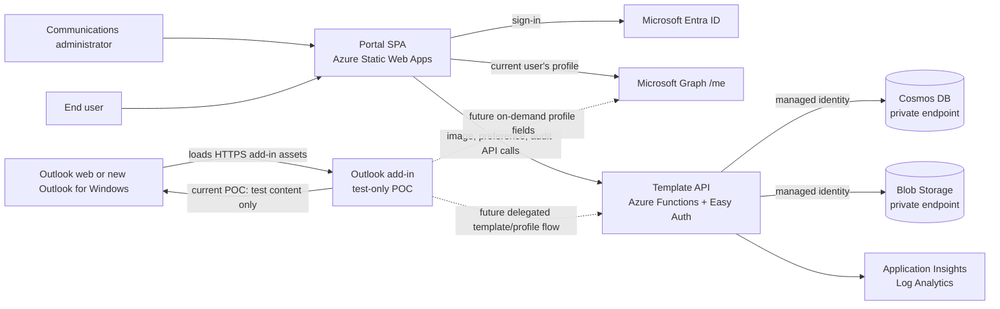
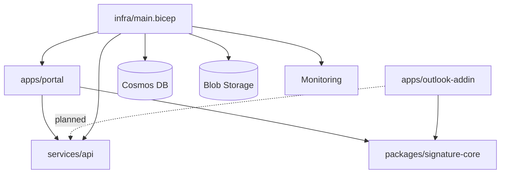
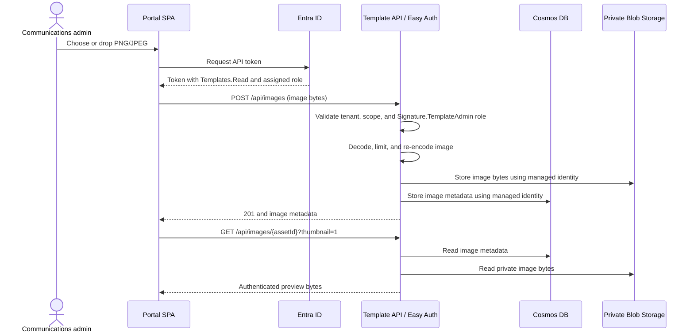
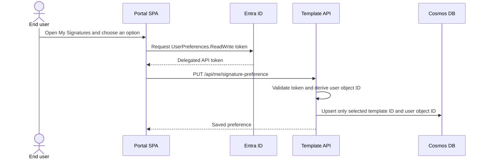
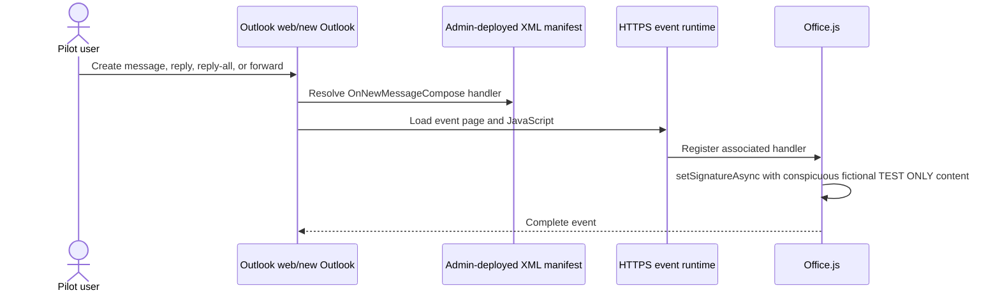
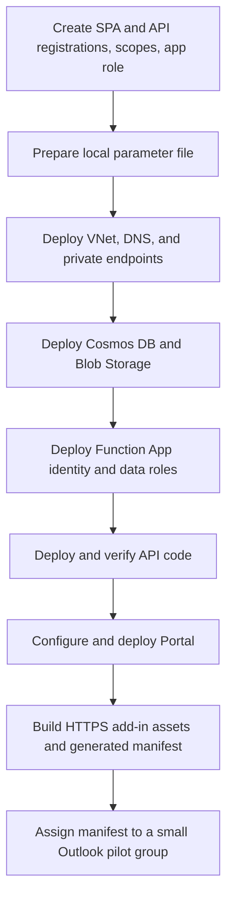

# Signature Studio — Solution Design

## 1. Purpose and current status

This document describes the application components, their dependencies, the data they exchange, and the intended end-to-end flows. It is the application architecture companion to:

- [README.md](README.md) — setup and deployment instructions.
- [InfrastructureDesign.md](InfrastructureDesign.md) — Azure resources, private storage access, troubleshooting, rollback, and cleanup.
- [design.md](design.md) — security boundaries, risks, and phased delivery plan.

The solution is a prototype, not a production signature service. The Portal, image/preference/audit API operations, and Azure foundation exist. The Outlook add-in is an event-based proof of concept that inserts clearly marked fictitious test data only. Durable template publishing and the production add-in data flow are not implemented.

## 2. System context



Solid lines describe existing interactions; dashed lines are planned. Cosmos DB and Blob Storage are not directly accessible from Outlook clients. The Function App reaches them over private endpoints, using its system-assigned managed identity.

## 3. Components and dependencies

| Component | Location | Responsibility | Depends on | Current state |
| --- | --- | --- | --- | --- |
| Management Portal | `apps/portal` | Template editing/preview prototype, profile preview, preference selection, and corporate image-library UI | React/Vite, shared signature core, MSAL, Entra, Template API when configured | Implemented; template authoring/catalog persistence is not implemented |
| Outlook add-in | `apps/outlook-addin` | Respond to the Outlook new-compose event and call `setSignatureAsync` | Office.js, Outlook Mailbox requirement set 1.10+, HTTPS-hosted event runtime and XML manifest | Test-only POC; inserts fictional data; not deployed/connected by default |
| Shared signature core | `packages/signature-core` | Template/profile types, safe text interpolation, and eligible/default template choice | TypeScript | Implemented and used by Portal and POC |
| Template API | `services/api` | Authenticated image, preference, and application-audit operations | Azure Functions, App Service Easy Auth, Cosmos SDK, Blob SDK, system identity | Image, preference, and audit-write routes implemented; published-template read/write routes are missing |
| Microsoft Entra ID | Tenant configuration | Authenticates users and issues delegated API tokens/app-role claims | Portal and API app registrations, scopes, consent, role assignments | Configured per deployment |
| Microsoft Graph | Microsoft service | Portal currently reads the signed-in user's own profile; planned add-in profile read is on demand | Delegated `User.Read` consent | Portal profile lookup implemented; add-in Graph flow is not implemented |
| Cosmos DB | `infra/main.bicep` | Template metadata, image metadata, selected template IDs, and audit records | Private endpoint, VNet/DNS, API managed identity and Cosmos SQL data-plane role | Private account provisioned by infrastructure; template catalog is not populated through a publication API |
| Blob Storage | `signature-assets` container | Persist approved corporate PNG/JPEG bytes | Private endpoint, VNet/DNS, API managed identity and Storage Blob data role | Image bytes persist; no public blobs or client storage credentials |
| Static Web Apps | `infra/main.bicep` | Host Portal and built add-in static files over HTTPS | Portal build; add-in assets are emitted to `apps/portal/dist/outlook-addin` | Portal deployed separately; add-in deployment and manifest assignment are pilot steps |
| Application Insights / Log Analytics | `infra/main.bicep` | API diagnostics and operational telemetry | Function App connection string, retention/access policy | Provisioned by infrastructure |

### Main package dependencies



The API does not depend on the browser or on Microsoft Graph. The add-in must not send profile values or compose content to the API.

## 4. Identity, authorization, and trust boundaries

There are separate identities and authorization checks at each boundary:

| Caller | Target | Required authorization |
| --- | --- | --- |
| Portal user | Entra and Graph `/me` | Single-tenant sign-in; delegated Graph `User.Read` |
| Portal user | Image list/download API | Delegated API scope `Templates.Read` |
| Communications administrator | Image upload API | `Templates.Read` plus app role `Signature.TemplateAdmin` |
| Signed-in user | Own preference API routes | Delegated API scope `UserPreferences.ReadWrite`; API derives user object ID from Easy Auth claims |
| API | Cosmos DB | Function App system-assigned managed identity with Cosmos DB Built-in Data Contributor data-plane role |
| API | Blob Storage | Function App managed identity with Storage Blob Data Contributor |
| Future add-in caller | Published template API | Read-only delegated authorization; exact endpoint and authorization contract remain to be implemented |

The API is behind App Service Authentication (Easy Auth), which validates the Entra access token and supplies the authenticated principal. API handlers still check the required scope and, for protected writes, the app role. Azure resource **Access control (IAM)** and Cosmos SQL data-plane RBAC are distinct; human Data Explorer access requires a separate Cosmos SQL role assignment. See [InfrastructureDesign.md](InfrastructureDesign.md#5-how-platform-admins-can-safely-view-persisted-data-for-troubleshooting).

The Portal's `VITE_` settings (SPA ID, tenant ID, API URL, scopes) are public browser configuration, not secrets. No client secret, access token, storage key, Cosmos key, or private certificate belongs in a browser bundle or source control.

## 5. Data stores and data minimization

| Store | Container/resource | Data allowed | Data explicitly excluded |
| --- | --- | --- | --- |
| Cosmos DB | `EmailSignatures/Templates` | Intended location for versioned, published template HTML, targeting and immutable image asset IDs | User profiles, tokens, message bodies, recipients, and subjects |
| Cosmos DB | `EmailSignatures/SignatureImages` | Image ID, name, content type, dimensions, byte length, timestamp, uploader object ID | Image bytes and access credentials |
| Cosmos DB | `EmailSignatures/UserSignaturePreferences` | Authenticated user's object ID and selected template ID | Email, profile fields, rendered signature, message information |
| Cosmos DB | `EmailSignatures/SignatureApplicationAudit` | Event ID, token-derived user object ID, template ID/version, outcome, server timestamp | Message ID/body, recipients, subject, attachments, email address, and profile values |
| Blob Storage | `signature-assets` | Normalized PNG/JPEG image bytes | Public URLs, tokens, profile values, or template HTML |
| Browser memory | Portal / future add-in process | Current profile response and preview/rendering values while needed | Durable profile copy, telemetry content, or local persistent profile cache |
| Future add-in cache | Outlook client | Bounded, versioned published template package and image bytes | User Graph profile and rendered personalized signature |

The current template container and Portal editor are not connected to a published-template persistence API. The API stores an image's metadata in Cosmos and its bytes in Blob Storage. User preference persistence stores only the selected template ID. Audit writes are implemented but the add-in does not call them yet.

## 6. Application flows

### 6a. Administrator uploads an image (implemented)



The API limits uploads to 1 MiB and 1600 × 1200 pixels, permits static PNG/JPEG, and re-encodes accepted files. The browser uses temporary object URLs only as a display cache.

### 6b. User selects a preferred template (preference route implemented; templates are still sample data)



The API never accepts a user ID from the request body. The selected template ID is persisted; the template list itself remains sample/in-memory until the publication API is implemented.

### 6c. Current Outlook add-in proof of concept



The proof of concept does not call Graph, the Template API, or the audit endpoint. It does not load corporate image assets. Existing drafts are not modified. `setSignatureAsync` operates on the current compose body's signature; it does not create an entry in Outlook's native **Insert Signature** list. Keep the add-in assigned only to a test group until the pilot content is replaced.

### 6d. Intended production compose flow (planned)

```mermaid
sequenceDiagram
    actor User as End user
    participant Outlook as Outlook compose
    participant Addin as Outlook add-in
    participant Cache as Bounded template/image cache
    participant Graph as Microsoft Graph /me
    participant API as Template API
    participant Audit as Audit endpoint and Cosmos

    Addin->>API: Refresh published templates/images outside compose event
    API-->>Addin: Eligible versioned templates and approved assets
    Addin->>API: Read signed-in user's selected template ID
    API-->>Addin: Preference or no override
    Addin->>Cache: Store template package and image bytes only
    User->>Outlook: Start new message/reply/forward
    Outlook->>Addin: OnNewMessageCompose
    Addin->>Cache: Select cached eligible template
    Addin->>Graph: Delegated on-demand request for approved /me fields
    Graph-->>Addin: Current profile values, held in memory
    Addin->>Addin: Render HTML; convert cached images to CID references
    Addin->>Outlook: setSignatureAsync and inline image attachments
    Outlook-->>Addin: Insertion result
    Addin->>API: Send minimal audit event only after success
    API->>Audit: Idempotent record with server timestamp
```

This target flow must not be treated as implemented. The add-in's compose handler should use cached template/image content and must not call the template API during event activation. Graph profile values remain in memory and never go to the API, persistent cache, telemetry, or message-service logs. CID image support, template refresh/authentication, retries, and an audit outbox require implementation and client testing.

## 7. Infrastructure deployment dependency order



The infrastructure deployment provisions resources; it does not deploy application code or assign the Outlook add-in. Detailed commands and rollback procedures are in [README.md](README.md) and [InfrastructureDesign.md](InfrastructureDesign.md).

## 8. Operational constraints and failure behavior

- Cosmos DB and Blob Storage remain private by default. Human troubleshooting access requires both data-plane permissions and a permitted network path.
- The Function App's managed identity is the only application identity that directly accesses Cosmos and Blob.
- The Portal and authenticated Function endpoint must be reachable over HTTPS by managed Outlook/browser clients. A route-specific Static Web App CSP permits Office.js and Outlook embedding only for `/outlook-addin/*`; the Portal retains its stricter CSP.
- The Outlook add-in's component design, deployment and maintenance sequences, security boundaries, pilot matrix, and troubleshooting runbook are documented in [apps/outlook-addin/Design.md](apps/outlook-addin/Design.md).
- Event-based activation is not a background scheduler. Template refresh happens when an interactive add-in surface next runs; cache freshness cannot be guaranteed while Outlook is closed.
- Do not promise full offline operation. An event-based add-in needs network access to load; fresh Graph attributes are unavailable if Graph cannot be reached.
- Existing native Outlook signatures and user edits require client-specific testing. The add-in is not a mail-flow enforcement mechanism.
- Audit success means Outlook accepted the insertion API call; it does not prove the user sent the message or left the signature unchanged.

## 9. References

- [Outlook event-based activation](https://learn.microsoft.com/en-us/office/dev/add-ins/develop/event-based-activation)
- [Outlook `setSignatureAsync`](https://learn.microsoft.com/en-us/javascript/api/outlook/office.body?view=outlook-js-1.10)
- [Azure Static Web Apps configuration](https://learn.microsoft.com/en-us/azure/static-web-apps/configuration)
- [Microsoft Graph: get the signed-in user](https://learn.microsoft.com/en-us/graph/api/user-get?view=graph-rest-1.0)
