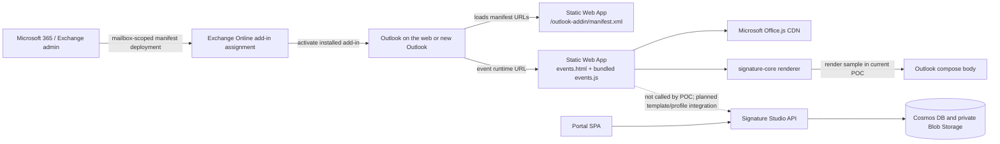
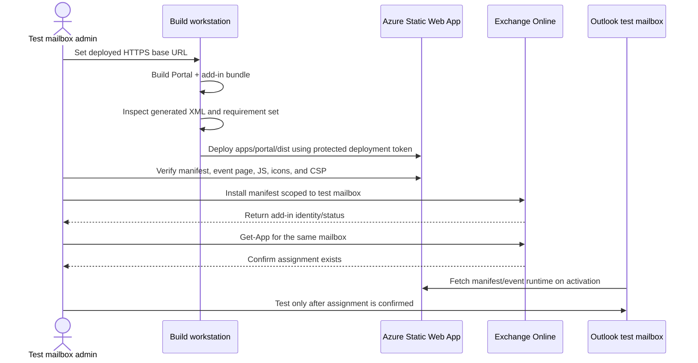
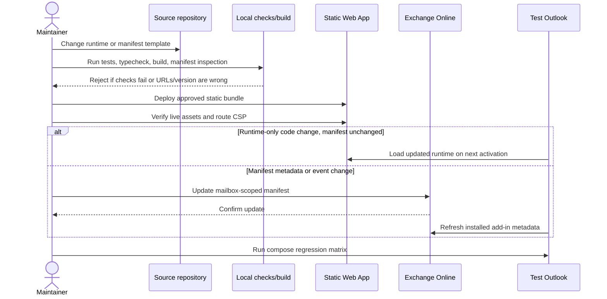

# Outlook add-in design and operations

## 1. Purpose and current scope

This document describes the Signature Studio Outlook add-in so it can be operated and maintained independently from the Portal. It records the current proof of concept (POC), its dependencies and security boundaries, deployment procedures, planned architecture, and support diagnostics.

> **Current state is a test-only POC.** The add-in uses fictitious profile data and inserts a visible `TEST ONLY` signature. It is not a production signature service. The Outlook installation attempt has failed with generic errors, and a successful Exchange deployment/activation has not yet been observed.

The first client target is Outlook on the web and new Outlook for Windows. The manifest declares the Outlook `OnNewMessageCompose` event at Mailbox requirement set 1.10. The event covers a new message, reply, reply-all, and forward; it does not cover editing an existing draft.

## 2. Component architecture



### Component and dependency inventory

| Component | Responsibility | Dependencies and trust boundary | Current status |
|---|---|---|---|
| Exchange Online | Assigns the add-in manifest to the mailbox and signals Outlook clients that it is available | Microsoft 365 tenant and Exchange Online admin privileges | No successful add-in assignment confirmed |
| Outlook host | Raises `OnNewMessageCompose`, provides the Office.js object model, and hosts the compose item | Supported Outlook client, mailbox, network access to the static HTTPS assets | Target clients; manual activation testing outstanding |
| Add-in-only XML manifest | Declares Mailbox host, requirement set 1.10, `ReadWriteItem`, event name, runtime resources, and HTTPS URLs | Must be schema-valid; URL host must match deployed resources; static manifest contains no secrets | Generated as version `1.0.1.0`; install still failing |
| Static Web App `/outlook-addin/*` | Serves `events.html`, the built runtime, taskpane, icons, and manifest | Public HTTPS is required so Outlook can fetch the files; route-specific CSP permits Office.js and Outlook frame ancestors only on this route | Deployed at the current pilot host |
| Office.js CDN | Supplies the Outlook JavaScript API to the event runtime | External dependency `https://appsforoffice.microsoft.com` | Referenced by `events.html` |
| `events.ts` / bundled `events.js` | Associates the manifest function name and handles compose activation | Office.js globals, shared renderer; no API/Graph calls in current POC | Renders a hard-coded fictional profile and template |
| `signature-core` | Renders a typed template using profile placeholders | Workspace TypeScript package | Used locally by the POC; included in the production bundle |
| Portal SPA | Template-editor prototype, image library, and preference UI | Entra SPA configuration and API | Separate app; shared Static Web App deployment |
| API, Cosmos DB, Blob Storage | Image and preference persistence; audit route | Easy Auth, delegated authorization, managed identity and private networking | Not called by add-in POC; template publishing/read API remains unimplemented |

## 3. Current operation and target operation

### Current POC behavior

- Outlook raises `OnNewMessageCompose`.
- The event handler obtains the current compose item's `body`.
- `signature-core` renders the static POC template and fictional profile.
- The handler invokes `body.setSignatureAsync` and completes the event.
- An API callback failure is logged to the browser console and the event completes.
- If the compose body is unavailable, the event is completed without insertion.

The add-in does not call Microsoft Graph, the Portal API, Cosmos DB, or Blob Storage. It has no user-specific cache, saved template selection, image handling, or audit writes.

### Intended production operation (not implemented)

The intended design separates refresh work from compose activation. Profile and template data are fetched using authenticated, least-privilege calls outside the time-sensitive compose handler. The handler renders from validated, bounded cached data and should not wait on a network request to insert the signature.

```mermaid
sequenceDiagram
    actor User
    participant Outlook as Outlook compose host
    participant Event as Add-in event runtime
    participant Office as Office.js
    participant Core as signature-core
    participant Cache as Validated in-memory cache

    User->>Outlook: Start new message, reply, reply-all, or forward
    Outlook->>Event: Raise OnNewMessageCompose
    Event->>Office: Read current compose item body
    Event->>Cache: Read eligible template, preference, profile, assets
    alt Cache contains valid selected signature
        Cache-->>Event: Cached template/profile/approved assets
        Event->>Core: Render signature HTML
        Core-->>Event: Sanitized, bounded signature markup
        Event->>Office: setSignatureAsync(signatureHtml)
        Office-->>Event: Async success or failure
        Event->>Outlook: event.completed()
    else Cache absent, expired, or invalid
        Cache-->>Event: No usable package
        Event->>Outlook: Complete safely; do not block compose
        Note over Event,Cache: Refresh is scheduled separately; error is observable and does not insert stale/unsafe markup
    end
```

The precise failure UX, stale-cache policy, profile refresh timing, and fallback signature remain design gates. Do not silently substitute a different corporate template or expose raw service errors in the compose body.

## 4. Security and privacy boundaries

### Current permissions

- Manifest permission: `ReadWriteItem` to update the current compose item signature.
- No Graph permission or API scope is currently used by the add-in.
- No client secret, API key, deployment token, or other credential belongs in the manifest or browser bundle.
- The sample profile values are fictitious; replace none of them with a real user profile until the approved authenticated Graph flow exists.
- The complete static bundle is public. Assume every manifest field and downloaded JavaScript byte is visible to any visitor.
- Only deploy/assign to the test mailbox. The compose body can be sent externally, so the `TEST ONLY` label does not make accidental sending harmless.

### Network and Content Security Policy

- Static Web App root policy stays strict and does not allow Office.js or Outlook framing.
- The route `/outlook-addin/*` has a route-specific CSP allowing `https://appsforoffice.microsoft.com` for script loading and the supported Outlook origins as `frame-ancestors`.
- The Portal build script adds the configured API origin to the Portal and add-in route `connect-src` directives. Current add-in code does not call that API.
- Outlook must fetch add-in pages over trusted public HTTPS. The Blob Storage and Cosmos DB public network access settings are independent and remain disabled; the add-in does not need direct data-store access.
- Recheck actual deployed response headers and asset status after every static-site deployment.

### Production security gates

Before adding live data:

1. Approve exact Graph delegated permissions and API scopes; request no application permissions for the Outlook client.
2. Authenticate using the supported Office identity APIs/MSAL design and the correct SPA/API registrations; validate tenant, audience, scopes, consent, and role claims server-side.
3. Keep profile fields and tokens in memory only; never log tokens, profile payloads, message body, signature HTML, or image bytes.
4. Treat template HTML and image sources as untrusted data. Validate publishing input, restrict markup and URLs, and use approved CID image attachments rather than public Blob URLs.
5. Bound cache size, lifetime, template/image count, and response bytes. Define deterministic invalidation, error reporting, and offline behavior.
6. Record only minimal audit information after successful insertion; do not include recipient lists or message content.
7. Review the manifest permission against the narrowest supported permission and test with actual Outlook clients.

## 5. Setup and deployment

### Prerequisites

- Node.js 22.12+ and npm for build/test.
- A working Azure CLI login with deployment permission to the existing development Static Web App.
- Exchange Online PowerShell on Windows for the pending mailbox-scoped installation path.
- A Microsoft 365 test mailbox and administrator identity authorized to install/assign Outlook add-ins.
- Public HTTPS reachability from Outlook to all manifest resource URLs.

### Build, inspect, and deploy

Follow the exact runnable steps in [README.md](README.md#build-and-locally-inspect) and [README.md](README.md#deploy-the-static-assets). Key constraints:

1. Build with `OUTLOOK_ADDIN_BASE_URL=https://<static-web-app-hostname>/outlook-addin`.
2. Inspect the generated manifest version, host, event resource URLs, and permission.
3. The root build also creates the Portal and API build outputs; the static deployment uploads the complete Portal `dist` directory.
4. Obtain the SWA deployment token just in time; never commit or display it.
5. Verify event HTML, JavaScript, manifest, icons, and CSP over HTTPS.
6. Use a mailbox-scoped Exchange deployment. Do not use the Integrated apps ZIP upload for this add-in-only XML manifest.
7. Verify Exchange assignment before testing Outlook.

### Windows mailbox-scoped Exchange Online deployment

This is the recommended next step but has **not yet succeeded**. Use the detailed commands in [README.md](README.md#install-the-event-based-add-in-for-the-test-mailbox). Key safety points:

- Windows PowerShell/Exchange Online module is used because the module in Linux Cloud Shell did not expose `-UserPrincipalName`.
- Do not use `Connect-ExchangeOnline -Device` from the Cloud Shell attempt; its auth window failed with `AADSTS900561`.
- Use `[System.IO.Path]::GetTempPath()` rather than `$env:TEMP` for portable temporary-file handling.
- Set `$ErrorActionPreference = "Stop"` in a script and guard download, file read, deployment, and confirmation sequentially.
- Use `New-App -Mailbox <test-user-UPN> -FileData <manifest bytes> -Enabled $true` only; never add `-OrganizationApp` or organization-wide assignments.
- Confirm using `Get-App -Mailbox <test-user-UPN>`. No result means deployment was not verified.
- If the cmdlet is absent, access is denied, or the add-in deployment errors, stop and capture the exact output. Do not use alternative broad commands.

### Manifest and version updates

The XML is generated from `manifest.xml.template` by `scripts/write-manifest.mjs`. When changing a manifest:

1. Increment `<Version>` in the template.
2. Preserve the nested `VersionOverridesV1_1` containing `<Runtimes>` and `LaunchEvent`.
3. Build using the deployed HTTPS base URL.
4. Run the local manifest parser and inspect the XML.
5. Deploy static assets, verify the deployed manifest returns the new version, then upload/update the manifest through the supported Exchange admin deployment path.
6. Verify the assigned app version and client behavior. Do not assume the static-file update alone updates an Exchange-stored manifest.

## 6. Setup and maintenance sequences

### First-time installation



### Static asset or manifest maintenance



## 7. Operational test and rollback

### Pilot test matrix

| Test | Expected result / evidence |
|---|---|
| Add-in appears in `Get-App -Mailbox` | Exact POC display name and enabled status; save output without exposing unrelated mailbox data |
| Open new message | Event activates and inserts the marked sample exactly once |
| Reply, reply-all, forward | Event activates and inserts sample; record each result separately |
| Edit existing draft | No activation expected by current event definition |
| Existing native Outlook signature | Record whether replaced/combined; current implementation does not preserve it intentionally |
| Repeat event/close-reopen compose | Record duplicates or replacement behavior; no production decision until tested |
| Offline/unreachable event URL | Compose remains usable; insertion may fail; collect browser/Outlook diagnostic and ensure no silent claim of success |
| Outlook on the web/new Outlook for Windows | Record client version, OS/browser, mailbox type, timestamp, and each test result |
| Rollback | Remove only the pilot mailbox assignment and verify Outlook no longer activates the POC |

Do not send test messages with the generated sample. Close or discard the drafts after inspection.

### Rollback layers

There are two independent rollback actions:

1. **Exchange assignment:** remove the exact add-in from the pilot mailbox using the supported Exchange Online cmdlet for the installed module; verify with `Get-App`. Do not remove organization apps or other add-ins.
2. **Static assets:** redeploy the last known-good Portal bundle to the same Static Web App. This does not remove the Exchange assignment.

Record the manifest version, Exchange app identity, deployment time, and last-known-good asset build before changing either layer. Refer to [README.md](README.md#remove-or-roll-back-the-pilot) for the safe mailbox-scoped steps.

## 8. Troubleshooting

Use the same four-part format as the SPA/infrastructure troubleshooting table: symptom, likely cause, where to check, and fix. Capture the exact error and timestamp. Never share passwords, one-time codes, access/deployment tokens, authorization headers, message content, or unredacted personal data.

| Symptom | Likely cause | Where to check | Fix |
|---|---|---|---|
| Outlook says “Installation failed” with no code | Outlook UI provides no diagnosis; possible manifest validation, unsupported install path, tenant policy, or service issue. Generic failure is not enough to choose one cause | Confirm the latest manifest URL/version; use the supported Exchange admin path; collect Exchange error output and Outlook diagnostics | Stop repeated self-service attempts. Deploy mailbox-scoped from Windows Exchange Online PowerShell; if it fails, retain the exact error and investigate that specific cause |
| Outlook reports installation is taking longer, then fails | The service did not confirm installation within the UI wait window; not proof of a specific XML error | Check `Get-App -Mailbox <test-user-UPN>` and Exchange output before retrying | If the app is listed, refresh/reopen Outlook and allow for propagation. If absent, stop and diagnose Exchange deployment; do not upload the XML as a ZIP |
| Integrated apps page only offers “Upload custom apps” and requests ZIP | This is the unified/custom app package upload surface, not the XML add-in-only manifest upload flow | Microsoft 365 admin center → Integrated apps; compare the selected flow with the manifest's `<OfficeApp xsi:type="MailApp">` | Do not zip the XML. Use the dedicated Add-ins manifest flow if available, otherwise use mailbox-scoped Exchange Online deployment |
| Hosted validator says GUID invalid/package type not identified, while local parser says `MailApp` | Hosted acceptance service may not support this submission format or returned an inconclusive result; local parsing alone also cannot guarantee install | `office-addin-manifest info`; hosted validator output; exact installed manifest bytes/version | Treat hosted result as unresolved. Check current Office schema and Outlook install errors; avoid changing the GUID or manifest type without a specific validator finding |
| `Connect-ExchangeOnline -UserPrincipalName` says parameter not found in Linux Cloud Shell | Linux Cloud Shell's Exchange module command surface did not expose that parameter in the reported environment | `Get-Module ExchangeOnlineManagement -ListAvailable`; `Get-Command Connect-ExchangeOnline -Syntax` | Use Windows PowerShell with the supported interactive sign-in, or if working on Linux, use an officially supported module flow after verifying command syntax; do not infer deployment success |
| `Connect-ExchangeOnline -Device` displays `AADSTS900561` | Cloud Shell device sign-in browser handoff sent an unsupported GET to a POST-only sign-in endpoint | Cloud Shell sign-in page and timestamp; error code `AADSTS900561` | Do not retry device auth repeatedly. Use Windows interactive browser sign-in or ask tenant admin/support for a supported authentication route |
| `$env:TEMP` is null in a Linux PowerShell session; download/read errors follow | Windows-specific temp environment variable was used on Linux; subsequent steps ran without stopping | PowerShell output for `Test-Path $env:TEMP`; script line numbers | Use `[System.IO.Path]::GetTempPath()`. Set `$ErrorActionPreference = "Stop"` and verify each step before proceeding |
| `New-App` not found after connecting | Exchange module/session did not import that cmdlet, connection is incomplete, or current role/RBAC lacks it | `Get-Command New-App -Syntax`; `Get-Module ExchangeOnlineManagement`; `Get-ConnectionInformation` | Stop. Verify supported Exchange module, successful connection, and Exchange admin permissions. Do not substitute an organization-wide deployment command |
| `New-App` reports access denied or a role/RBAC error | Connected identity lacks Exchange app deployment rights or role assignment has not propagated | Exact cmdlet error; Microsoft 365 admin role assignment; Exchange RBAC role | Ask a tenant Exchange/Global admin to run the mailbox-scoped deployment; do not broaden assignment as a workaround |
| `Get-App -Mailbox` returns no Signature Studio POC | The mailbox assignment was not created, deployment targeted another mailbox, or deployment is still propagating | Confirm the exact UPN passed to `New-App`, its result, and `Get-App -Mailbox` output | Do not test or claim installation. Resolve the Exchange command result first |
| Add-in appears in Exchange but does not insert `TEST ONLY` | Event not activated, incompatible client/requirement set, stale add-in metadata, script/asset failure, CSP, or Office.js load issue | Outlook web/new Outlook client and version; event page/script HTTP status; browser console/network; deployed route CSP | Refresh/reopen Outlook; verify all `/outlook-addin/*` URLs and headers; confirm client supports Mailbox 1.10; preserve diagnostics before changing the manifest |
| Event page or script returns 404 or Portal HTML | Wrong `OUTLOOK_ADDIN_BASE_URL`, static deployment omitted add-in files, or SPA fallback intercepted path | Open `/outlook-addin/events.html`, `/assets/events.js`, and `/manifest.xml`; inspect status, content type, and body | Rebuild with the exact HTTPS base URL and deploy the complete `apps/portal/dist`; keep `/outlook-addin/*` excluded from navigation fallback |
| Browser console shows CSP blocked Office.js or frame ancestor | Missing or incorrect route-specific CSP on deployed Static Web App | Network response headers for `/outlook-addin/events.html`; compare with root `/` CSP | Rebuild/deploy [staticwebapp.config.json](../portal/public/staticwebapp.config.json); Office.js and Outlook framing permissions must be add-in-route-only |
| Runtime logs signature application failure | Outlook `setSignatureAsync` returned failure or synchronous call failed | Outlook browser console during a test compose; record client, time, and whether body existed | Do not assume insertion succeeded. Check Outlook API support and item state; retain failure detail and complete the event safely |
| `New-App` succeeds but add-in update is not reflected | Static web files changed but Exchange still has an older stored manifest/version, or Outlook metadata is cached | Compare deployed `manifest.xml` version with Exchange add-in version; refresh Outlook | Upload/update the mailbox-scoped manifest using the supported Exchange deployment method; refresh/reopen Outlook and verify |

## 9. Roadmap and support ownership

| Phase | Deliverable | Exit evidence |
|---|---|---|
| P0 — installation diagnosis | Install current manifest only to the test mailbox from Windows, using a stop-on-error procedure | `Get-App` confirms assignment; exact client event activation observed |
| P1 — compose behavior | Stable, non-duplicating insertion and defined native signature/edit behavior | Completed test matrix on OWA and new Outlook for Windows; rollback verified |
| P2 — profile and template | Approved Graph identity flow, persisted template publishing API, authenticated refresh and bounded cache | Least-privilege consent, API tests, cache/error/eligibility tests |
| P3 — assets, preferences, audit | Safe CID images, saved selection, minimal success-only audit | Security and privacy review plus integration tests |
| P4 — production rollout | Monitoring, support playbook, staged deployment, release/rollback policy | Owner sign-off, documented client matrix, no test fixtures, operational alerts |

Until P0–P4 are complete, keep the add-in labeled test-only and restrict it to the test mailbox.
