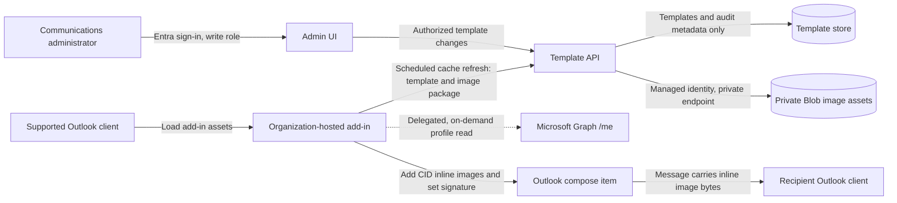

# Outlook Signature Management: Security and Delivery Design

## Decision

**A first-party Outlook add-in is a viable alternative to a signature-management SaaS product, subject to a client-compatibility and security proof of concept.** The organization accepts a delegated, on-demand Microsoft Graph read of the signed-in user's profile. The solution will not bulk-export, background-sync, or persist Entra profile data in its service or client cache.

The design must distinguish these two requirements:

- **No Entra ID synchronization or stored copy:** feasible. The add-in requests the current user's required profile fields directly from Microsoft Graph when composing a message, uses the response in memory, and discards it. This direct Graph read is an accepted requirement, subject to tenant consent and least privilege.
- **No Entra ID reads at all:** incompatible with dynamically filling directory-only fields such as job title, department, and business phone. Outlook's mailbox profile provides only a limited set of identity details. In that stricter case, reduce the fields or have users enter and maintain them themselves; do not silently introduce another profile store.

A Graph profile lookup is still an Entra ID data access, even when it is on demand and not a synchronization. Keeping the service in the organization's tenant improves governance and control, but does not by itself remove risks such as compromised credentials, excessive permissions, vulnerable code, or misconfigured logging. Messages sent to external recipients leave the tenant by design; the signature service itself will not receive or store message content or user profile values.

The add-in may cache published templates and template IDs locally, but never Graph profile values or rendered signatures. It can therefore insert from its cached template without contacting the template API, while still requiring Graph connectivity for fresh profile fields. Outlook event-based add-ins require an internet connection to launch, so this is **template-service-independent insertion**, not a guarantee of operation when fully offline.

## Microsoft Sample Assessment

Microsoft's [Set your signature using Outlook event-based activation sample](https://learn.microsoft.com/en-us/samples/officedev/office-add-in-samples/outlook-add-in-set-signature/) establishes that an Outlook add-in can handle compose events and set a signature with `setSignatureAsync`.

The sample lists Outlook on Windows (new and classic), Outlook on the web, and the new Outlook for Mac UI, for clients supporting Outlook requirement set 1.10. Current Microsoft event-based activation documentation also lists `OnNewMessageCompose` support on Android and iOS, and `setSignatureAsync` is supported in mobile message compose on current versions. Mobile support therefore appears feasible, but must be verified against the organization's deployed Outlook versions. The unified manifest is not supported on Mac or mobile; use the add-in-only manifest for those clients, or maintain manifest variants if required.

The sample is a technical reference, not a base repository for this project. Implement the add-in and portal specifically for this solution. Its [source repository](https://github.com/OfficeDev/Office-Add-in-samples/tree/main/Samples/outlook-set-signature) demonstrates mapping compose events to a handler, a shared event-handler implementation with client-specific runtime entry points, a task pane for selecting signature variants, and CID-embedded images. Reuse those architectural lessons, not its code or user-managed signature data flow.

Event activation applies to new message compose, including reply, reply-all, and forward, but not editing an existing draft. The sample uses both embedded image attachments and remotely referenced image URLs. Prefer CID-embedded or organization-approved tenant-hosted images; never use third-party image URLs, since recipient clients may fetch them outside the tenant. Validate client behavior, user edits, and coexistence with native signatures in a proof of concept.

### Signature records, choices, and refresh behavior

- `setSignatureAsync` writes or replaces a signature in the current compose item's body. It does **not** create or update a named record in Outlook's built-in **Insert Signature** menu. The signature is dynamically rendered at compose time from the selected template and the current Graph profile response.
- Give each corporate template a stable template ID and monotonically increasing version. The cache and user preferences refer to that ID; publishing a revision updates the version for future insertions after refresh. Do not depend on a hidden marker inside signature HTML: Outlook may normalize the body, and there is no supported API to update a named native signature record. This does not rewrite signatures in sent mail or old drafts.
- Users can have multiple eligible signature templates, but they are choices in this solution's Outlook add-in picker, not separate native Outlook signature records. The admin portal publishes a default and optional alternatives; users can choose which one to insert for a message. Favorites may be offered as a convenience, but are not part of the initial persisted preference contract.
- Persist only the selected template ID through the authenticated per-user preference API and cache published templates, not user profile values or rendered personal signatures. Favorites remain transient UI state unless a future approved design explicitly expands the preference data contract. The client cache should be bounded and versioned.
- Outlook event handlers are short-lived and are not a background scheduler. Refresh templates on a configured freshness interval when the add-in next runs in an interactive surface; the compose event uses the last cached published template and does not call the template API. There is no guaranteed timer while Outlook or the add-in is closed. If Graph is unreachable, fresh Entra fields cannot be populated without persisting them, so the add-in must use an approved omission/failure behavior rather than a hidden profile cache.

## Requirements and Boundaries

### Functional scope

- Communications administrators publish versioned templates and assign a default template, with optional rules for approved business units.
- The admin portal provides rich-text template creation/editing, dynamic profile-field insertion, approved logo/image upload, targeting, and an Outlook-like preview. Published HTML is restricted to an approved, sanitized markup set; arbitrary script, remote media, and unsafe styles are not allowed.
- In **My Signatures**, end users can select an eligible signature and preview its rendered content with their signed-in Entra profile before choosing it as their default.
- The add-in uses the user's explicitly selected eligible template. If no selection exists, it uses the eligible organization default. Favorites are separate from this default choice.
- The SPA shows Signature Studio templates assigned/eligible for the signed-in user. It cannot inspect native Outlook **Settings > Accounts > Signatures** or the ribbon **Insert > Signature** list; those aren't exposed by Graph or Office.js.
- The add-in applies a signature to supported compose events for new messages, replies, and forwards, subject to client testing.
- Dynamic fields are limited to attributes available from an approved, on-demand source. Missing values have defined fallback behavior.
- No appointment signature behavior is required for the initial release.

### Data and trust boundaries

- **Template service:** stores template HTML, targeting rules, publication metadata, and immutable image asset IDs only. It must not store user profiles, access tokens, message content, recipients, or subjects.
- **Image assets:** approved PNG/JPEG signature images are stored in a private Azure Blob container with public access disabled, versioning, and soft delete. Administrators upload through the authenticated API; the add-in never receives storage credentials or public Blob URLs.
- **Runtime profile lookup:** the add-in requests the signed-in user's minimum required profile fields directly from Microsoft Graph using delegated access. Profile values remain in the client process, are not sent to the template API, and are not logged or cached by this solution.
- **Client cache:** during scheduled/next-active refresh, the add-in retrieves the published template and its approved image bytes through the authenticated API and caches them with the template version. Compose activation uses the cache and does not call the template or image service.
- **Compose item:** the add-in adds each image as an inline attachment and references it with a CID in the signature HTML. Image bytes travel with the message; recipients do not need network access to the Blob service or any external image host. Inline images increase message size and some clients may also display them in the attachment list.
- **User preference:** persist only the selected template ID, keyed by the authenticated user's Entra object ID in a private Cosmos container. Both the SPA and Outlook add-in use the `UserPreferences.ReadWrite` delegated API scope and the same preference endpoint. The API derives the object ID from the validated token; clients cannot select or read another user's preference. No profile fields or rendered content are stored.
- **Application audit:** after `setSignatureAsync` succeeds, the add-in sends an idempotent event to the authenticated API. The API derives the actor's Entra object ID (`oid`) from the validated token and records event ID, user object ID, template ID/version, `applied-to-compose` outcome, and server timestamp. It must ignore client-supplied actor IDs and exclude email addresses, profile values, recipients, subjects, message IDs, and body content.
- **Audit meaning:** an event proves that the add-in inserted a template into a compose item. It does not prove the message was sent/delivered or that the user did not later edit/remove the signature.
- **Hosting:** add-in files, admin UI, API, and template storage are organization-managed Azure resources. Their endpoints may be internet-accessible so managed Outlook clients can reach them; being hosted in the tenant does not itself make an endpoint private. Apply tenant authentication, network controls, TLS, and logging restrictions appropriate to the organization's threat model.
- **Third parties:** do not load fonts, images, scripts, analytics, or other assets from third-party hosts. Prefer embedded or tenant-hosted images. Microsoft 365, Entra ID, and Graph remain Microsoft services involved in normal operation.

### Security requirements

- Entra-authenticated administrators only. Enforce authorization in the API, not just by hiding UI controls. Prefer an app role assigned to the Communications group; verify the token issuer, audience, expiry, and role on every write.
- Least-privilege delegated Graph access for the signed-in user's own required profile fields only. Obtain security and tenant administrator approval. Do not use app-only directory permissions or enumerate users for signature rendering.
- Keep the MSAL token cache in memory for the portal session. Keep the Graph profile response in application memory only; do not store it in browser storage, a cookie, the template API, or analytics.
- Treat audit user object IDs as personal data. Restrict audit reads to an assigned audit role, use an approved retention period, and do not use the audit store as a directory/profile cache.
- Separate admin write access from add-in read access. The add-in must never receive a template-write capability.
- Use managed identity for Azure service-to-service access. Do not embed storage keys, database connection strings, or secrets in browser assets or source control. Keep secrets in Key Vault only where managed identity is not supported.
- Store templates only in the data store. Restrict data-plane access; disable public database access or use private networking where compatible with the deployment. The browser-facing API must remain reachable from supported clients and should expose only the minimum required operations.
- Do not log profile values, rendered signatures, message bodies, tokens, or sensitive query strings. Review Application Insights and platform diagnostic settings before launch; set retention and access controls.
- Accept only approved raster image formats (initially PNG and JPEG); reject SVG, animated formats, remote URLs, oversized dimensions/files, and image metadata not required for rendering. Enforce limits and content validation on the server, not only in the portal.
- Validate and sanitize template markup, allow only approved HTML/CSS constructs, and prevent arbitrary scripts, remote content, and unsafe URLs. Treat template publishing as a privileged code-like operation with review and audit history.
- Use HTTPS, a restrictive Content Security Policy, dependency pinning/scanning, controlled deployment, and a documented rollback path. Audit admin changes and alert on unexpected publishing or authorization failures.
- The portal now ships Static Web Apps security headers, including a restrictive CSP, in `apps/portal/public/staticwebapp.config.json`. The build adds only the exact HTTPS API origin from `VITE_TEMPLATE_API_URL` to `connect-src`; verify MSAL redirect/popup behavior after deployment.
- The audit handler enforces its 4 KiB request limit against streamed bytes even when `Content-Length` is absent or inaccurate. Retain an ingress-level request limit as defense in depth.
- GitHub Actions CI runs tests, type checks, builds, and dependency auditing on Node.js 22.14; keep these checks required for pull requests before accepting changes.

## Proposed Architecture

The add-in obtains the template and, if approved, the current user's profile separately. It combines them in memory and sends neither profile data nor the compose item to the template API. Do not introduce a background job that copies Entra attributes into the database.

### Components

1. **Outlook add-in:** independently implemented Office.js event-based add-in. Request only the Outlook permissions required to set the signature and minimum delegated Graph permission for the signed-in user's profile. Use a separately scoped delegated API token for published-template refresh and user-portal actions. The compose handler reads cache only; it does not call the template API.
2. **Admin and user portal:** organization-hosted web application for template authoring, preview, review, publishing, and end-user selection. Communications administrators manage templates and targeting; end users can see the default and eligible alternatives, manage transient favorites, and choose a signature. Authenticate with Entra ID and enforce administrator authorization server-side.
3. **Template API:** small Azure-hosted API with separate read/write authorization. It serves published template/image packages, accepts approved image uploads, reads/writes a user's own selected template ID, receives application audit events, and exposes an authorized audit report. It does not call Graph for profile lookup or accept profile/message fields in audit payloads.
4. **Template, preference, and audit stores:** Cosmos DB stores versioned templates, per-user selected template IDs, and successful application events in separate containers. Preference records contain only user object ID and selected template ID. Audit records contain an event ID, token-derived user object ID, template ID/version, outcome, and server timestamp. Configure audit TTL to the approved retention period.
5. **Image store:** private, versioned Azure Blob container for PNG/JPEG originals. The Function App accesses Cosmos and Blob using managed identity and private endpoints; clients never receive storage keys or public asset URLs.
6. **Centralized deployment:** deploy the add-in-only manifest to a pilot group through Microsoft 365 centralized deployment, then expand by ring. Structure the event runtime to support the client-specific launch assets required by Outlook (including classic Windows versus web/new Outlook/Mac), while sharing the underlying signature logic. Publish add-in web assets over HTTPS from an organization-controlled endpoint.

## Key Risks and Trade-offs

| Risk | Consequence | Mitigation or decision |
| --- | --- | --- |
| Manifest or Outlook version does not support mobile event activation | Some users may not receive the managed signature | Use the add-in-only manifest for Mac/mobile and verify the organization's current Outlook versions in the pilot matrix. |
| Graph access or required profile fields are blocked by consent policy | Some dynamic fields cannot be populated | Confirm exact delegated scope and fields with the tenant administrator; use approved fallbacks for fields unavailable to `/me`. |
| Event activation or token acquisition differs across clients | Missing, delayed, or inconsistent signatures | Test supported client/version matrix, event timeout behavior, API outage behavior, and token flow before infrastructure build-out. |
| Outlook is fully offline or Graph is unreachable | Event activation may not run, or fresh Entra values cannot be populated | Do not promise full offline operation. Use the cached template only when Outlook can run the add-in and Graph is reachable; define behavior for unavailable profile data. |
| Templates cannot refresh while Outlook and the add-in are closed | Client cache may remain stale until next activation | Refresh on a configured interval the next time the portal/add-in is active; show cache age and retain the last published version for insertion. |
| Saved choice is missing, stale, or no longer eligible | Wrong or unavailable signature could be inserted | Validate the selected template ID/version against the current eligible cache on each compose; fall back to the eligible organization default. |
| Audit write fails after compose insertion | Signature is present, but its audit event may be missing | Use an idempotency ID, bounded retries, and an approved pending-event outbox; expose unacknowledged audit writes and never report them as confirmed. Decide whether audit-service failure should block insertion. |
| Audit data is over-retained or broadly accessible | Persistent user activity data exposure | Treat object IDs as personal data; restrict audit reads, minimize fields, configure approved TTL, and audit access to audit reports. |
| Image URLs are fetched by recipients | Recipient privacy exposure, broken logos, and dependence on external hosts | Prohibit remote image URLs; use CID inline attachments so image bytes are carried within the message. |
| Inline image size or client rendering differs | Larger messages, attachment-list entries, or layout differences | Limit image count, format, dimensions, and file size; set alt text and explicit display dimensions; test external recipients and supported Outlook clients. |
| Users expect their choices in Outlook's native Insert Signature menu | Native menu will not show or manage add-in templates | Provide a signature picker in the Outlook add-in; document that it is separate from Outlook's native menu. |
| Existing native signatures or user edits conflict | Duplicate or altered signatures; no server-side enforcement | Define native-signature coexistence policy and test new/reply/forward scenarios. A client add-in is not an immutable mail-flow control. |
| Azure endpoints are reachable from client networks | Attack surface and potential metadata exposure | Entra authentication, narrow API surface, network restrictions where workable, dependency controls, and PII-free telemetry. |
| A required client cannot reach the add-in or API | Signature insertion fails | Provide a clear failure mode and operational support path; do not claim universal client coverage. |

## Cost and Operations

Do not treat the previous `$0` or `<$1` estimates as commitments. Actual cost depends on region, hosting plan, logging volume, network security features, availability requirements, and usage. Free/serverless tiers can have limits and may not satisfy production security or support requirements. Produce a cost estimate after choosing hosting and network controls.

A production service also needs an owner for dependency updates, certificate and identity configuration, template approvals, monitoring, incident response, backups, and manifest rollout. Serverless hosting reduces server administration; it does not make the service maintenance-free.

## Build Plan

### Phase 0: Confirm policy and scope

- Record the agreed boundary: no bulk Entra export, background synchronization, or persistent profile copy; delegated, on-demand Graph reads of the signed-in user's required fields are allowed.
- Confirm the minimum delegated Graph scope, required `/me` fields, fallback values, business-unit/management-level targeting rules, and tenant admin-consent process.
- Confirm the required Outlook client versions, including mobile, and the add-in-only manifest strategy for Mac/mobile support.
- Inventory Outlook clients, versions, platforms, native signature settings, network restrictions, and centralized deployment capability.
- Define data classification, retention, audit, availability, and security review requirements.

**Exit gate:** The accepted data boundary, exact profile fields/permissions, and supported-client scope are documented; tenant consent can be obtained.

### Phase 1: Minimal proof of concept

- Implement a minimal add-in from this project's own source and manifest, using Microsoft's sample and API docs as references only; deploy only to a small pilot group.
- Verify event-based activation, `setSignatureAsync`, and signature behavior in new, reply, and forward compose flows on each in-scope client.
- Test delegated token acquisition and the least-privilege profile request. Confirm the exact returned fields and ensure they are not sent to the template API, persisted, or logged.
- Test duplicate native signatures, offline/API failure, slow network, repeated compose events, and add-in update/rollback behavior.
- Record client-specific gaps and performance; do not proceed on assumed cross-client parity.

**Exit gate:** Required clients and compose flows pass, or stakeholders accept documented exceptions. The security team approves the data flow and permissions.

### Phase 2: Production design and threat review

- Finalize manifest type and version, Entra app registrations/scopes, app roles, API authorization, and consent workflow.
- Threat-model template authoring, token handling, add-in supply chain, API exposure, storage access, telemetry, and compromise/rollback scenarios.
- Select Azure hosting and storage based on network and availability requirements. Define managed identity, private access, backup/restore, logging, retention, and alerting.
- Define template validation, dual review for publication, versioning, audit events, and change rollback.
- Define approved image formats, maximum dimensions/size/count, image review and upload workflow, Blob retention, and recipient-side CID behavior.
- Approve the audit event fields, audit-reader role, retention period, retry/outbox behavior, and whether an unavailable audit API blocks or delays signature insertion.

**Exit gate:** Architecture and threat model are approved; cost, operational ownership, and recovery objectives are documented.

### Phase 3: Implement the minimum product

- Build the add-in runtime and manifest for the approved clients.
- Build the read-only published-template endpoint and separate authenticated admin write endpoints.
- Build the admin portal for template creation, editing, preview, validation, approval, publication, and rollback.
- Add authorized image upload/preview and immutable asset references; store image bytes only in the private Blob container.
- Build the end-user picker for the default and role-eligible alternatives, with one active choice per compose item. Favorites are optional transient UI convenience and are not persisted in the initial release.
- Persist only the selected template ID through `UserPreferences.ReadWrite`; validate eligibility on every compose and use the organization default when no saved choice is present or valid. Do not store the selection or favorites in Outlook roaming settings.
- Implement a bounded, versioned client template cache. Refresh on the configured freshness interval when the add-in/portal next runs; never call the template API from the compose handler.
- Add delegated, on-demand Graph profile retrieval; keep Graph values client-side and memory-only.
- Implement a success-only audit endpoint and authorized audit view. Derive actor OID from the validated API token; store event ID, template ID/version, outcome, and server timestamp. Make writes idempotent and retry delivery without recording message/profile contents.
- Add automated tests for template rendering/sanitization, authorization, missing attributes, and API behavior. Add CI checks, dependency scanning, and controlled deployment.

### Phase 4: Security validation and pilot

- Verify that no profile or message data is persisted or emitted in logs, telemetry, API requests, or crash reports.
- Test unauthorized reads/writes, expired/wrong-audience tokens, role changes, malicious template input, remote asset blocking, and storage/network restrictions.
- Test uploaded image content validation, private Blob authorization, cache refresh without profile persistence, CID embedding, delivery to external recipients, and missing/corrupt asset fallbacks.
- Verify one acknowledged audit event per successful application, correct actor/template version, duplicate-event idempotency, retry/outage reporting, retention expiry, and denial of unauthorized audit reads.
- Deploy to a representative pilot group; monitor only operational metadata and collect user-reported failures without capturing message content.
- Obtain security sign-off and resolve or explicitly accept findings before expansion.

### Phase 5: Rollout and operations

- Roll out in rings with documented communications, support instructions, and rollback criteria.
- Monitor availability, event failures, API latency, and deployment health without logging signature/profile contents.
- Review permissions, group membership, dependencies, template access, audit history, and restore readiness periodically.
- Reassess support whenever Microsoft changes Outlook clients, Office.js requirements, or centralized deployment behavior.

## Acceptance Criteria

- No bulk Entra export, sync job, or persistent user-profile store exists.
- The add-in reads only the signed-in user's explicitly approved profile fields on demand; no profile values or tokens reach the template API, persistence, logs, or analytics.
- No subject, recipient, body, or attachment data is sent to the signature service.
- Only authorized Communications administrators can publish; add-in clients can read published templates but cannot write.
- An admin portal supports corporate template creation, versioning, approval, default assignment, and role/department eligibility rules.
- Administrators can create and edit signature content with rich-text formatting, insert approved profile placeholders, target departments/job titles, and preview sample rendering; published markup is sanitized server-side against an approved allowlist.
- Administrators can upload approved logo/image assets; assets remain private in Blob Storage, are versioned, and are retrieved only through the authorized API.
- Add-in cache refresh includes referenced image bytes; compose insertion uses CID inline attachments with no image-service request at compose time, and recipients receive no third-party image URL.
- End users can view the default and eligible alternatives and choose one signature to insert; the default is used if they have not selected another. Favorites, if offered, are transient and are not shared across clients.
- The API persists only the selected template ID. The add-in validates it against current eligibility and falls back to the organization default when unset or invalid; it does not persist preferences in Outlook roaming settings.
- Every successful signature insertion produces an idempotent audit record with token-derived Entra object ID, template ID/version, outcome, and server timestamp; the audit record contains no message content, recipients, subject, email address, or profile fields.
- Audit access is role-restricted and retention-limited; failed or unacknowledged audit writes are observable and are not represented as confirmed records.
- Selecting an eligible signature in **My Signatures** previews it with the signed-in user's current Graph profile, with missing fields shown as empty or using approved fallbacks.
- MSAL tokens and Graph profile values are memory-only and are cleared when the session ends; the portal requests only delegated `User.Read` for `/me`.
- The add-in inserts from its versioned template cache without a template API call. Cache refresh occurs at the configured interval when the add-in/portal next runs; the interface exposes the last successful refresh time.
- Documentation clearly distinguishes the add-in picker from Outlook's native **Insert Signature** menu and makes no full-offline guarantee.
- Sanitized templates render as expected, and missing profile fields use approved fallbacks.
- All supported client and compose-flow combinations, including required mobile versions, pass the Phase 1 matrix; any unsupported combinations are clearly documented.
- Security review, operational ownership, monitoring, rollback, and recovery procedures are approved before broad deployment.

## Reference

- [Microsoft sample: Set your signature using Outlook event-based activation](https://learn.microsoft.com/en-us/samples/officedev/office-add-in-samples/outlook-add-in-set-signature/)
- [Microsoft sample source: Outlook set-signature add-in](https://github.com/OfficeDev/Office-Add-in-samples/tree/main/Samples/outlook-set-signature)
- [Microsoft guidance: Event-based activation in Outlook mobile](https://learn.microsoft.com/en-us/office/dev/add-ins/outlook/mobile-event-based)
- [Outlook JavaScript API requirement sets](https://learn.microsoft.com/en-us/javascript/api/requirement-sets/outlook/outlook-api-requirement-sets)
- [Outlook `setSignatureAsync` API](https://learn.microsoft.com/en-us/javascript/api/outlook/office.body#outlook-office-body-setsignatureasync-member%281%29)
- [MSAL.js browser token caching](https://learn.microsoft.com/en-us/entra/msal/javascript/browser/caching)
- [Microsoft Graph: Get the signed-in user](https://learn.microsoft.com/en-us/graph/api/user-get?view=graph-rest-1.0)
